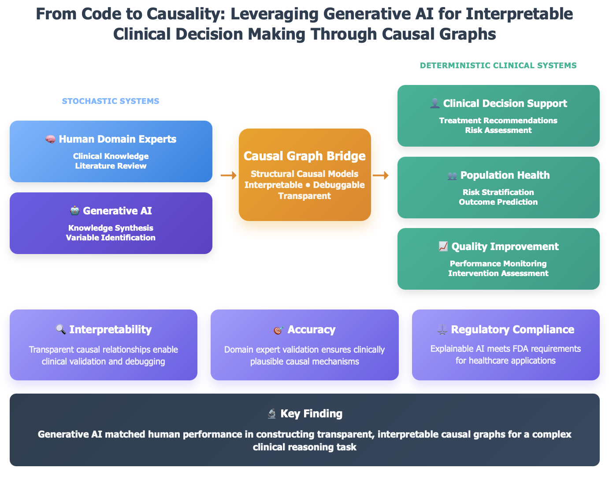

# Interpretable Clinical SCM: Generative AI vs Human Performance

## Abstract

This repository contains supplementary materials for "Leveraging Generative AI for Interpretable Clinical Decision Making Through Causal Graphs," which compares transformer-based large language models against human performance on complex causal reasoning tasks using structural causal models (SCMs).

## Study Overview

We evaluated how both human domain experts and state-of-the-art AI systems construct interpretable causal models for clinical inference. Using data from the Midwest Healthcare Conference Causal Diagram Challenge, participants and AI models created SCMs to estimate COVID-19 glucocorticoid treatment effects on 28-day mortality using real-world data from more than 2,000 hospitalized patients.

**Key Finding:** Generative AI matched human performance in constructing transparent, interpretable causal graphs for complex clinical reasoning tasks, with the best models achieving >90% bootstrap coverage against RECOVERY trial benchmarks in two out three severity strata.

## Repository Contents

- **`prompt_materials/`**: Contains materials related to the generative AI prompts used in this project. This includes data dictionaries, user documentation, and the specific prompts given to the AI.
- **`results/`**: This directory includes the outputs of the analyses, such as forest plots and error analysis documents.
- **`scms/`**: Contains the structural causal models (SCMs) that are central to this repository. The SCMs are organized into subdirectories based on their file format (`graphml`, `json`, `png`).
- **`graphical_abstract.png`**: A visual summary of the project.

