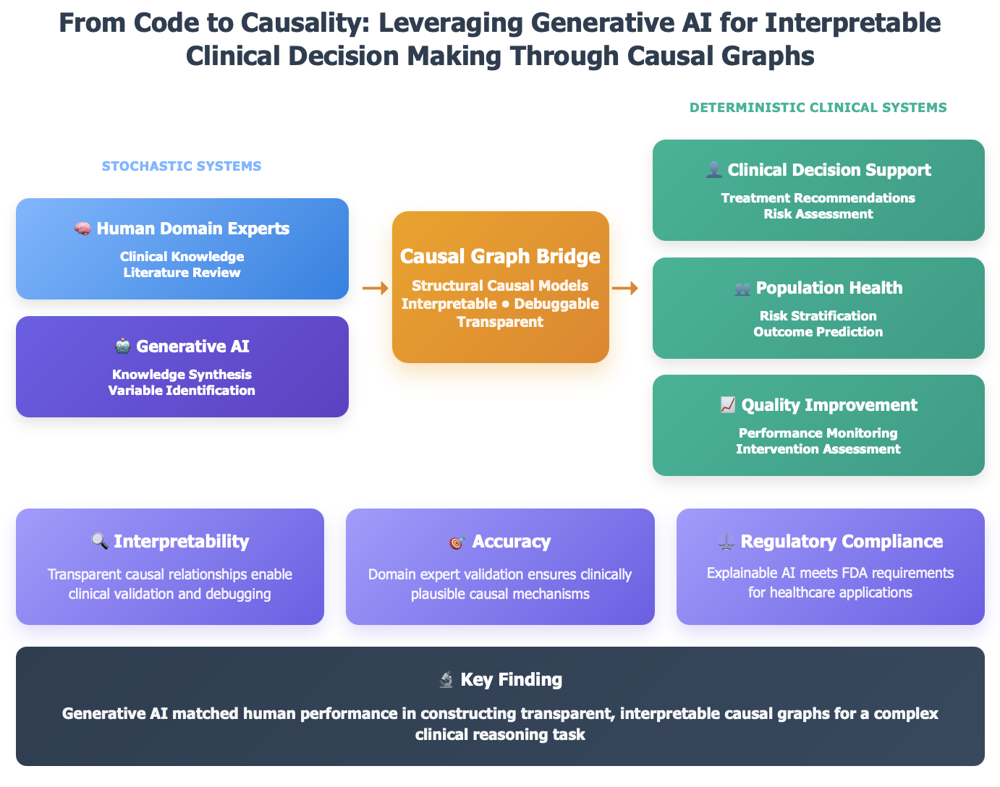

# Interpretable Clinical SCM: Generative AI vs Human Performance

## Abstract

This repository contains supplementary materials for "Leveraging Generative AI for Interpretable Clinical Decision Making Through Causal Graphs," which compares transformer-based large language models against human performance on complex causal reasoning tasks using structural causal models (SCMs).

## Study Overview

We evaluated how both human domain experts and state-of-the-art AI systems construct interpretable causal models for clinical inference. Using data from the Midwest Healthcare Conference Causal Diagram Challenge, participants and AI models created SCMs to estimate COVID-19 glucocorticoid treatment effects on 28-day mortality using real-world data from more than 2,000 hospitalized patients.

**Key Finding:** Generative AI matched human performance in constructing transparent, interpretable causal graphs for complex clinical reasoning tasks, with the best models achieving >90% bootstrap coverage against RECOVERY trial benchmarks in two out three severity strata.

## Repository Contents

### Analysis Code

- **`potential_outcomes/`**: Causal effect estimation scripts organized by AI model:
  - `claude/`: Claude model analysis scripts and results processing
  - `deepseekr1/`: DeepSeek-R1 model analysis with utility functions
  - `gemini/`: Gemini model analysis and evaluation scripts
  - `openai/`: OpenAI model analysis with bootstrap metrics computation

### Prompt Materials

- **`prompt_materials/`**: Materials used to prompt generative AI models:
  - `causal_plausibility/`: Task descriptions for assessing causal relationship plausibility
  - `potential_outcomes/`: Prompts for causal effect estimation tasks
  - `scm/`: Structural causal model construction prompts
  - `sdy1662_data_dictionary.csv`: Data dictionary for the COVID-19 dataset
  - `PSBsession.md`: Pacific Symposium on Biocomputing session documentation

### Structural Causal Models

- **`scms/`**: AI-generated and human-created structural causal models:
  - `graphml/`: Graph models in GraphML format
  - `json/`: SCM specifications in JSON format
  - `png/`: Visual representations of causal graphs

### Results

- **`results/`**: Analysis outputs and visualizations:
  - `severity1_forestplot.png`, `severity2_forestplot.png`, `severity3_forestplot.png`: Forest plots showing treatment effect estimates across severity strata
  - `sign_errors.pdf`: Error analysis document
  - `causal_edges_plausibility_scores.csv`: Plausibility ratings for proposed causal relationships

### Other Files

- **`graphical_abstract.png`**: Visual summary of the project
- **`LICENSE`**: MIT License

